I am following the tutorials in [_Ray Tracing in One Weekend_](https://raytracing.github.io/books/RayTracingInOneWeekend.html) but writing the code in C for good practice.  

These are my notes from the book and what I learned in the process.

## Raytracing
At its core, a ray tracer sends rays through pixels and computes the color seen in the direction of those rays. The involved steps are

- Calculate the ray from the “eye” through the pixel,
- Determine which objects the ray intersects, and
- Compute a color for the closest intersection point.

## The aspect ratio
A 16∶9 aspect ratio means that the ratio of image width to image height is 16∶9.  
For a practical example, an image 800 pixels wide by 400 pixels high has a 2∶1 aspect ratio. 

## The output image
The book writes the image to a file in the PPM format. The PPM format is a text-based format that starts with a header that describes the image size and color depth. The header is followed by the pixel data, which is written as a series of RGB triplets. 
ex:
```
P3
800 450
255
220 234 255
220 234 255

```
In the above example P3 is just a magic number and has no connection with the display color depth. The next line is the image size, 800 pixels wide by 450 pixels high. The last line is the color depth, 8 bits in this case but can be seen as the is the maximum value for each color. Everything after that is the image data: RGB triplets.  
https://en.wikipedia.org/wiki/Netpbm 


## The Viewport
The viewport is a virtual rectangle in the 3D world that contains the grid of image pixel locations. If pixels are spaced the same distance horizontally as they are vertically, the viewport that bounds them will have the same aspect ratio as the rendered image. The distance between two adjacent pixels is called the pixel spacing, and square pixels is the standard. 
We'll initially set the distance between the viewport and the camera center point to be one unit. This distance is often referred to as the focal length.  
While our 3D space has the conventions above, this conflicts with our image coordinates, where we want to have the zeroth pixel in the top-left and work our way down to the last pixel at the bottom right. This means that our image coordinate Y-axis is inverted: Y increases going down the image. 
 We'll also have the y-axis go up, the x-axis to the right, and the negative z-axis pointing in the viewing direction. (This is commonly referred to as right-handed coordinates.)

## Ray-Sphere Intersection
(unfortunately Jekill doesnt render the math equations so will have to write them out later)
The equation for a sphere of radius r that is centered at the origin is an important mathematical equation: 

$$
x^2 + y^2 + z^2 = r^2
$$

If a given point (x,y,z) is inside the sphere, then $x^2 + y^2 + z^2 < r^2$ , and if a given point (x,y,z) is outside the sphere, then $x^2 + y^2 + z^2 > r^2$.

If we want to allow the sphere center to be at an arbitrary point (Cx,Cy,Cz) in 3D, then the equation becomes:  
$$
(Cx−x)^2 + (Cy−y)^2 + (Cz−z)^2 = r^2
$$

This formula looks very similar to the definition of a dot product of a vector from point P = (x,y,z) to a center C = (Cx,Cy,Cz) which is (C-P).

The dot product of this vector with itself is:  

$$
(C−P)⋅(C−P)=(Cx−x)^2+(Cy−y)^2+(Cz−z)^2 = r ^ 2
$$ 

We can read this as “any point P that satisfies this equation is on the sphere”.  

Remember that on our ray P is a function of t, so we can substitute P = Q + td into the equation and solve for t. (Q is the origin of the ray, and d is the direction of the ray.)

The only unknown is t, and we have a $t^2$, which means that this equation is quadratic. 
You can solve for a quadratic equation $ax^2+bx+c=0$ by using the quadratic formula:

$$
x = \frac{-b \pm \sqrt{b^2 - 4ac}}{2a}
$$

So solving for t in the ray-sphere intersection equation gives us these values for a, b, and c:
$$
a=d⋅d
b=−2d⋅(C−Q)
c=(C−Q)⋅(C−Q)−r2
$$

where Q is the origin of the ray, d is the direction of the ray, C is the center of the sphere, and r is the radius of the sphere.

Really we just need to know if the square root also called the discriminant is real and positive. If it is, then the ray intersects the sphere at two points. If it is zero, then the ray is tangent to the sphere. If it is negative, then the ray misses the sphere entirely.

$$
\sqrt{b^2 - 4ac}
$$

In code:
```c
bool hit_sphere(const t_sphere *s, const t_ray *r) 
{
    t_vec3 cq = vec3substr(&(s->center), &(r->orig));
    double a = dot(&(r->dir), &(r->dir));
    double b = -2.0 * dot(&(r->dir), &cq);
    double c = dot(&cq, &cq) - s->radius * s->radius;
    double discriminant = b*b - 4*a*c;
    return (discriminant >= 0);
}
```

## The Normal Vector
This is a vector that is perpendicular to the surface at the point of intersection. 

Ex For a sphere, the outward normal is in the direction of the hit point minus the center: 

## Which side of the sphere are we on?
We need to choose to determine the side of the surface at the time of geometry intersection or at the time of coloring.
This is a boolean determined with the dot product
```c
bool front_face;
if (dot(ray_direction, outward_normal) > 0.0) {
    // ray is inside the sphere
    normal = -outward_normal;
    front_face = false;
} else {
    // ray is outside the sphere
    normal = outward_normal;
    front_face = true;
}
```

## An array of shapes in C? How!?
Thanks to this course I discovered that you can have polymorphic behavior in C. 
It is a bit weird at first but totally doable.  

I have a struct, `t_hittable` that has a function pointer to a hit function.  

To create an array of different shapes (like spheres and cubes) that all implement the [`hittable`]interface or behaviour, I define a struct `t_hittable` that contains a function pointer for the `hit` function:

```c
typedef struct s_hittable {
    bool (*hit)(const void* self, const t_ray* r, double t_min, double t_max, t_hit_record* rec);
} t_hittable;
```

Then, for each shape (like a sphere or a cube), you create a struct that includes the `t_hittable` struct as its first member:

```c
typedef struct {
    t_hittable base;
    t_point3 center;
    double radius;
} sphere;

typedef struct {
    t_hittable base;
    t_point3 min;
    t_point3 max;
} cube;
```
**This is very important: the `hittable` struct must be the first member of the shape structs.**  
This is because the C standard guarantees that the address of the first member of a struct is the same as the address of the struct itself. This allows you to cast a pointer to a `sphere` or `cube` to a `hittable` pointer and back without any issues.

You can then define the `hit` functions for each shape:

```c
bool hit_sphere(const void* self, const t_ray* r, double t_min, double t_max, t_hit_record* rec) {
    // implementation...
}

bool hit_cube(const void* self, const t_ray* r, double t_min, double t_max, t_hit_record* rec) {
    // implementation...
}
```

The functions all take a `const void* self` parameter, which is a pointer to the shape struct. This allows you to cast the pointer to the appropriate shape struct inside the function.

When you create a new shape, you set the `hit` function pointer in the `hittable` struct to the appropriate function:

```c
t_sphere* new_sphere(t_point3 center, double radius) {
    sphere* s = malloc(sizeof(sphere));
    s->base.hit = hit_sphere;
    s->center = center;
    s->radius = radius;
    return s;
}
```
Or actually without malloc is also possible since I have small structs I can return them by value.  
I did not do the necessary tests but I imagine Using malloc to allocate memory would take use some 
extra time. Stack is faster than heap, but then I copy the struct when returning it. I do not yet know which is faster.  

```c
t_sphere new_sphere(t_point3 center, double radius) {
	sphere s;
	s.base.hit = hit_sphere;
	s.center = center;
	s.radius = radius;
	return s;
}
```
Then in the main function, you can create a list of `t_hittable` pointers and add your shapes to it:

```c
t_hittable *list[2];
t_sphere s1 = sphere(vec3(0, 0, -1), 0.5);
t_sphere s2 = sphere(vec3(0, -100.5, -1), 100);
list[0] = (t_hittable*)(&s1);
list[1] = (t_hittable*)(&s2);
const t_hittablelist world = hittablelist(list, 2);
```

This already works and I get the second sphere creating a nice background.


To check if a ray hits any of the shapes, you can loop over the array and call the `hit` function through the function pointer:

```c
for (int i = 0; i < 10; i++) {
    if (shapes[i]->hit(shapes[i], r, t_min, t_max, &rec)) {
        // hit
    }
}
```
This would be quite cool but turns out that we will use an extra struct to keep track of the world. Since c++ has vectors which are a kind of dynamic array in C, I created a t_hittablelist struct that contains an array of hittable pointers and a size. Knowing the size is important. For now that's it, later I will add some more functions to add elements etc.

```c

typedef struct 	s_hittablelist {
	t_hittable 	**list;
	int 		size;
	bool 		(*hit)(const void* self, const t_ray* r, double ray_tmin, double ray_tmax, t_hit_record* rec);
} 				t_hittablelist;
```

And so we have a hit function on world that will loop through the list of hittables and call their hit functions.

```c
bool hit(const void *self, const t_ray* r, double ray_tmin, double ray_tmax, t_hit_record* rec)
{
	 	t_hittablelist *hittablelist = (t_hittablelist *)self;
		t_hit_record temp_rec;
		bool hit_anything = false;
		double closest_so_far = ray_tmax;
		int i = 0;

		while (i < hittablelist->size)
		{
			if (hittablelist->list[i]->hit(hittablelist->list[i], r, ray_tmin, closest_so_far, &temp_rec))
			{
				hit_anything = true;
				closest_so_far = temp_rec.t;
				*rec = temp_rec;
			}
			i++;
		} 
	return (hit_anything);
}

t_hittablelist hittablelist(t_hittable **list, int size)
{
	t_hittablelist hittablelist;

	hittablelist.list = list;
	hittablelist.size = size;
	hittablelist.hit = hit;
	return (hittablelist);
}
```

## Useful to have - An Interval type

In C++ it is a class, in C it will be a struct. The interval type is useful to keep track of the t_min and t_max values. 
```c
typedef struct {
	double t_min;
	double t_max;
} t_interval;
```


## The Camera
In C we do not have classes of course but we will still refactor the code in its own file with its struct and functions.
The camera is responsible for two important jobs:

    - Construct and dispatch rays into the world.
    - Use the results of these rays to construct the rendered image.

After main creates a camera and sets default values, it will call the render() method.  
The render() method will prepare the camera for rendering and then execute the render loop.

## Passing by value or by reference?
In C++ we have references which are variables that can be passed around without copying. In C we have pointers. But pointers bring a problem. 
If I declare the sum like
```c
t_vec3 add(t_vec3 *a, t_vec3 *b)
{
	t_vec3 sum;
	sum.x = a->x + b->x;
	sum.y = a->y + b->y;
	sum.z = a->z + b->z;
	return (sum);
}
```
Then if using the add functions for two vectors I have to pass pointers then I cannot use the add function with the result of another add function. Like this is working but I have to create a temp extra var c:
```c
t_vec3 a = vec3(1, 2, 3);
t_vec3 b = vec3(4, 5, 6);
t_vec3 c = add(&a, &b);
t_vec3 d = add(&c, &c);
```
This will not work because the add function expects pointers and I cannot in C take the pointer of a rvalue return value . So I will have to use the add function like this:
```c
t_vec3 a = vec3(1, 2, 3);
t_vec3 b = vec3(4, 5, 6);
t_vec3 c = vec3(&add(&a, &b), &add(&a, &b));
```

With small structs there is a very small performance hit when passing by value. So I will pass by value and this allows to chain functions and have better readable code.
```c
t_vec3 add(t_vec3 a, t_vec3 b)
{
	t_vec3 sum;
	sum.x = a.x + b.x;
	sum.y = a.y + b.y;
	sum.z = a.z + b.z;
	return (sum);
}
```
now:
```c
t_vec3 a = vec3(1, 2, 3);	
t_vec3 b = vec3(4, 5, 6);
t_vec3 d = add(add(a, b), add(a, b));
```
It is much nicer.

## Using unions in C
A union is a special data type available in C that allows to store different data types in the same memory location. You can define a union with many members, but only one member can contain a value at any given time. Unions provide an efficient way of using the same memory location for multiple-purpose.
In my case I have a vector in 3d with x y and z components. Also I have a color type with 3 components too. I can use alias to use the same struct for both. Also I discovered that I can use a union to have access to rgb and xyz at the same time.  In C++ I would use encapsulation and private/public members with getters and setters but in C I dont have this level of abstraction.
```c
typedef struct s_vec3 {
    union {
        struct {
            double x, y, z;
        };
        struct {
            double r, g, b;
        };
    };
} t_vec3, t_color, t_point3;
```

## Antialiasing
If we look at our zoomed image created until now we see that the edges are jagged like pixels on a staircase. To fix this we will take multiple samples per pixel and average the color. This is called antialiasing. In the book also there is an interesting note about the human eye and how it perceives color.
> With a single ray through the center of each pixel, we are performing what is commonly called point sampling. The problem with point sampling can be illustrated by rendering a small checkerboard far away. If this checkerboard consists of an 8×8 grid of black and white tiles, but only four rays hit it, then all four rays might intersect only white tiles, or only black, or some odd combination. In the real world, when we perceive a checkerboard far away with our eyes, we perceive it as a gray color, instead of sharp points of black and white.

We need to sample the light falling around the pixel, and integrate the changes.

To do so we will create a random number generator to sample the colors around the pixel in a random way. 

Here the C random number generator has been apparently superiour to the c++ one for quite some time. Interesting.
<div style="text-align: center;">
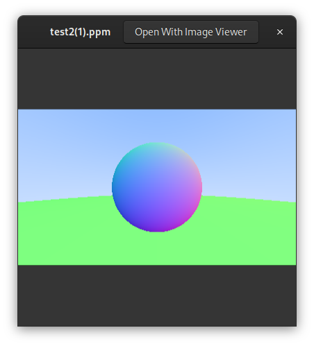 
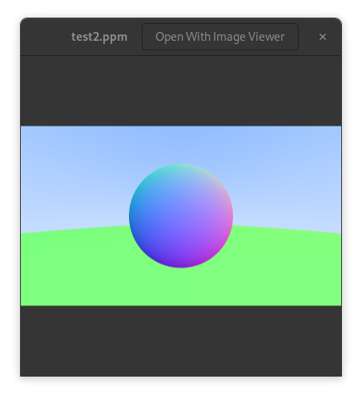
</div>

## Extras - the compile_commands.json file
If using nvim the LSP will ask for a compile_commands.json file. This file is can be generated by the compiledb tool. 
```
make clean && make > build.log
compiledb -n < build.log      
```

## Diffuse materials

Diffuse objects that don’t emit their own light merely take on the color of their surroundings, but they do modulate that with their own intrinsic color. Light that reflects off a diffuse surface has its direction randomized.  
We will add the ability to generate arbitrary random vectors to our t_vec3 type. This will be useful for generating random directions for diffuse materials. 
In c++ they are both called random but I cannot use the same name in C. I will call them random_vec3 and random_vec3_min_max.
```c
t_vec3 random_vec3() 
{
    return vec3(random_d(), random_d(), random_d());
}

t_vec3 random_vec3_min_max(double min, double max) 
{
    return vec3(random_double(min,max), random_double(min,max), random_double(min,max));
}
```
Then we need to figure out how to manipulate a random vector so that we only get results that are on the surface of a hemisphere, the side where we have our normal.  
The book explains that we can generate a random vector in the unit cube and then check if it is inside the unit sphere. If it is not we discard it. This is called rejection sampling.

## Shadow acne
Do to floating points errors we ignore hits that are very close to the calculated intersection point. Due to these errors we can calculate a hit point that is just a bit below the surface of the object. This is called shadow acne. 
To fix this we will add a small epsilon value to the t_min value in my ray_color function.
```c
if ((world)->hit(world, r, interval(0.001, INFINITY), &rec))
	{
		t_vec3 direction = random_on_hemisphere(rec.normal);
		t_ray scattered = ray(rec.p, direction);
		return vec3multscalar(ray_color(&scattered, depth - 1, world), 0.5);
	}
```

This is why we have intervals :)  

The result is now gray and it takes quite a while to generate due to the recursive method in our ray_color function.  

<div style="text-align: center;">
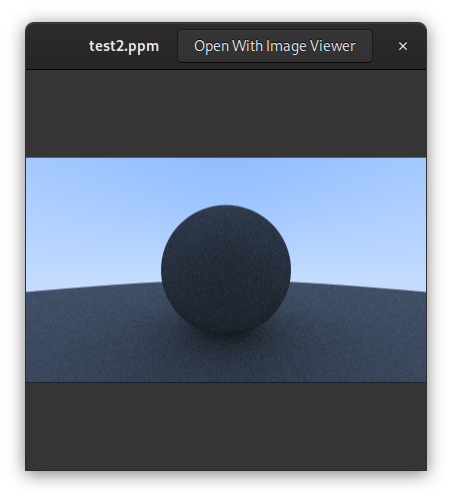
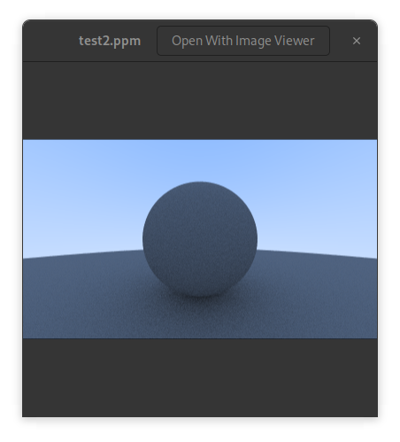
</div>

## Lambertian reflection
A reflected ray is most likely to scatter in a direction near the surface normal.
This makes very much sense but I refer to the book for the explanation!
It is a small change in the ray_color function. 
```c
// from 
	t_vec3 direction = random_on_hemisphere(rec.normal);
// to	
	t_vec3 direction = vec3add(rec.normal, random_unit_vector());
```
It is not terribly visible but the image is a bit more realistic.
<div style="text-align: center;">

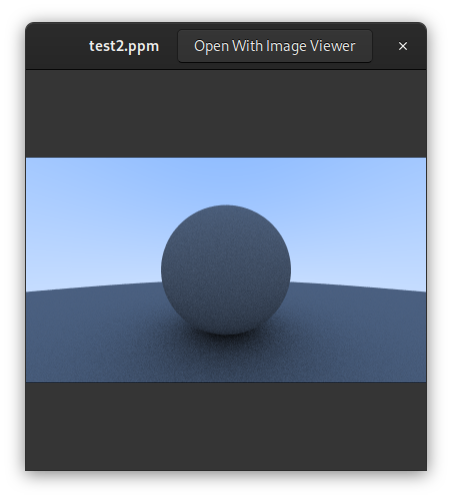
</div>


## Gamma correction
The book explains that the human eye does not perceive light linearly. The eye is more sensitive to changes in darker colors than in lighter colors. This is why we need to apply gamma correction to our image.  
We need to go from linear space to gamma space, which means taking the inverse of “gamma 2", which means an exponent of 1/gamma, which is just the square-root. 

Not bad. The image is muc brighter now for .5 grey.
<div style="text-align: center;">

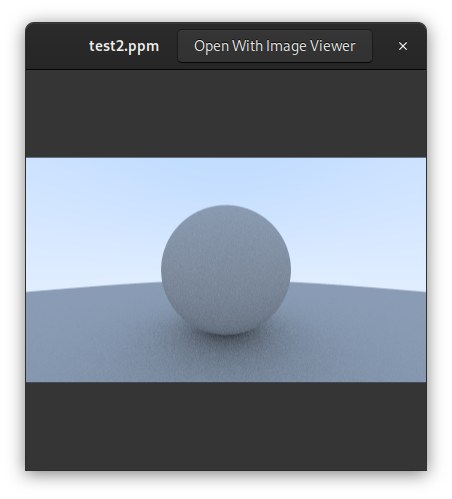
</div>

## Metal
The material needs to do two things:

	- Produce a scattered ray (or say it absorbed the incident ray).
    - If scattered, say how much the ray should be attenuated.

In C++ it is an abstract class. In C I will use a struct with a function pointer to a hit function. 

```c
typedef struct s_material {
	bool (*scatter)(const void* self, const t_ray* r_in, const t_hit_record* rec, t_vec3* attenuation, t_ray* scattered);
} t_material;
```
We are going to put a pointer to a material in our hit record.  
Also, hit_record needs to be told the material that is assigned to the sphere.  Our sphere struct will have a material pointer.  
 

## Albedo
The term albedo (Latin for “whiteness”) is used to describe the fraction of incident light that is reflected by a surface. It is used to define some form of fractional reflectance. Albedo will vary with material color.  
We will implement Lambertian (diffuse) reflectance first. This is the simplest form of reflection.  

How to impement this in C where in C++ we would have a virtual function?
Objects like my sphere will have pointers to a `t_material` struct and this `t_material` struct is also included in the `t_hit_record`:

- I will define a `material` struct with a function pointer for the `scatter` function. This function determines how materials interact with rays.

- In `hit_record` include a pointer to the `material` of the object hit.

- Objects (e.g., spheres) include a pointer to the `t_material` struct, 

- Implement functions for different materials. These functions should match the signature of the `scatter` function pointer in the `material` struct.

- When creating objects, assign a material to them by setting the material pointer to point to an instance of a `material` struct configured with the appropriate scatter function.

- When a ray hits an object, the `t_hit_record` will be populated with information about the hit, including the material of the object. The ray tracing logic can then use the `scatter` function through the `t_hit_record`'s material pointer to determine the color and direction of the scattered ray.

But since I have different materials with different properties I will create a struct for each material with their unique properties. Ex the lambertian material has albedo. The Base in the struct is the material pointer and then I have the specific properties. I can pass this struct to the scatter function since it expects a material pointer and I have this in the base struct. 

ex:
```c
// Example of creating a lambertian material
t_lambertian lambertian_material;

// Function to initialize a Lambertian material
void lambertian_init(t_lambertian *lambertian_material, t_color albedo) 
{
    lambertian_material->base.scatter = lambertian_scatter; // Assign the scatter function
    lambertian_material->albedo = albedo; // Set the albedo
}

bool lambertian_scatter(void* self, const t_ray *r_in, const t_hit_record *rec, t_color *attenuation, t_ray *scattered) 
{
	(void)r_in;
	t_lambertian *lamb = (t_lambertian *)self;
	t_vec3 scatter_direction = vec3add(rec->normal, random_unit_vector());
    *scattered = ray(rec->p, scatter_direction);
    *attenuation = lamb->albedo;
        return true;
    return true; 
}
```

Lambertian surfaces scatter all incoming light uniformly in all directions, but the amount of light scattered is proportional to the surface's albedo.

In the `scatter` function of the `lambertian` class, the `albedo` is used to set the `attenuation` of the scattered ray. The `attenuation` represents how much the ray's intensity is reduced upon scattering. For a Lambertian material, this attenuation is simply the albedo of the material, indicating that the color of the scattered light is influenced by the color of the material itself.

Here's a breakdown of the process:  

- Scatter Direction:  new direction for the scattered ray is calculated by adding a random unit vector to the hit normal. This simulates diffuse reflection, where light is scattered in many directions.
- Attenuation: The `attenuation` parameter is set to the material's `albedo`. This means the scattered light's color is influenced by the material's color, simulating how real-world surfaces absorb some wavelengths of light more than others, thereby coloring the light that is reflected.
- Scattered Ray: The `scattered` ray is created with its origin at the point of intersection (`rec.p`) and its direction set to the calculated scatter direction. This ray represents the path of the light after it has interacted with the material.

## Metals
For polished metals the ray won’t be randomly scattered. 
Follow the book for the math explanation but for metals and polished surface we need to calculate the reflection of the ray.
The reflection of a ray is calculated by reflecting the ray direction across the surface normal. This is done by subtracting the ray direction from the normal twice. 
```c
inline t_vec3	vec3reflect(const t_vec3 v, const t_vec3 n) 
{
    return vec3substr(v, vec3multscalar(n, dot(v, n) * 2));
}
```

## reflections and refractions
Since I am not using C++ I cannot use the abstract class approach and my code is slightly more convoluted. In main at this stage I need to initialize my spheres 
in this way:
```c
	t_lambertian lambertian_material_ground;
	t_lambertian lambertian_material_center;
	t_metal metal_material_left;
	t_metal metal_material_right;

   	lambertian_init(&lambertian_material_ground, color(0.8, 0.8, 0.0));
	lambertian_init(&lambertian_material_center, color(0.1, 0.2, 0.5));
    metal_init(&metal_material_left, color(0.8, 0.8, 0.8), 0.3);
	metal_init(&metal_material_right, color(0.8, 0.6, 0.2), 1.0);

	// Assuming t_lambertian and t_metal have a t_material as their first member,
	// you can safely cast their addresses to t_material*.
	t_sphere s1 = sphere(point3(0.0, -100.5, -1.0), 100.0, (t_material*)&lambertian_material_ground);
	t_sphere s2 = sphere(point3(0.0, 0.0, -1.2), 0.5, (t_material*)&lambertian_material_center);
	t_sphere s3 = sphere(point3(-1.0, 0.0, -1.0), 0.5, (t_material*)&metal_material_left);
	t_sphere s4 = sphere(point3(1.0, 0.0, -1.0), 0.5, (t_material*)&metal_material_right);


	t_hittable *list[4];

	list[0] = (t_hittable*)(&s1);
	list[1] = (t_hittable*)(&s2);
	list[2] = (t_hittable*)(&s3);
	list[3] = (t_hittable*)(&s4);

	//world!
	const t_hittablelist world = hittablelist(list, 4);
```
The result is breathtaking. It works! This is the power of math!

<div style="text-align: center;">
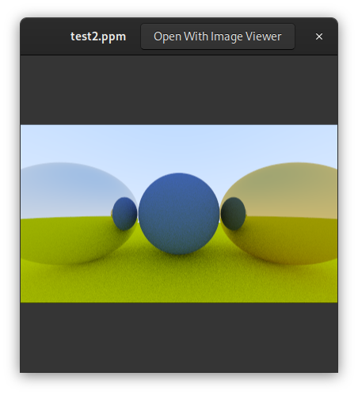

</div>

## Fuzziness
We can also randomize the reflected direction by using a small sphere and choosing a new endpoint for the ray. We'll use a random point from the surface of a sphere centered on the original endpoint, scaled by the fuzz factor. The bigger the fuzz sphere, the fuzzier the reflections will be. This suggests adding a fuzziness parameter that is just the radius of the sphere (so zero is no perturbation). Also, we need to normalize the reflected ray. 

## Dielectrics
Clear materials such as water, glass, and diamond are dielectrics.
When a light ray hits them, it splits into a reflected ray and a refracted (transmitted) ray.  
 a reflected ray hits a surface and then “bounces” off in a new direction.

A refracted ray bends as it transitions from a material's surroundings into the material itself (as with glass or water). This is why a pencil looks bent when partially inserted in water. 

The amount that a refracted ray bends is determined by the material's refractive index. Generally, this is a single value that describes how much light bends when entering a material from a vacuum. Glass has a refractive index of something like 1.5–1.7, diamond is around 2.4, and air has a small refractive index of 1.000293. 

Imagine to render a glass ball under water, then the glass ball would have an effective refractive index of 1.125. This is given by the refractive index of glass (1.5) divided by the refractive index of water (1.333).  

Look in the book for Snell’s law and the Fresnel equations.
```c
/*
 * Refract function
 * params: uv, n, etai_over_etat
 * uv: unit vector of the ray
 * n: normal of the surface
 * etai_over_etat: ratio of the refractive indices
 */
inline t_vec3 refract(const t_vec3 uv, const t_vec3 n, double etai_over_etat) 
{
    double cos_theta = fmin(dot(vec3negate(uv), n), 1.0);
    t_vec3 r_out_perp =  vec3multscalar(vec3add(uv, vec3multscalar(n, cos_theta)), etai_over_etat);
    t_vec3 r_out_parallel = vec3multscalar(n, -sqrt(fabs(1.0 - length_squared(r_out_perp))));
    return vec3add(r_out_perp, r_out_parallel);
}
```
again this is the result with snell's law implemented.:

<div style="text-align: center;">
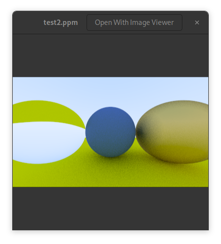
</div>

This is not all however, sice there is a critical angle at which the refracted ray is parallel to the surface. This is called total internal reflection. 
For this we update the scatter function to take this into account. 

 
```c
bool dielectric_scatter(void *self, const t_ray* r_in, const t_hit_record *rec, t_color *attenuation, t_ray *scattered)
{
	t_dielectric *dielectric = (t_dielectric *)self;
	*attenuation = color(1.0, 1.0, 1.0);
	double ri = rec->front_face ? (1.0 / dielectric->refraction_index) : dielectric->refraction_index;
	t_vec3 unit_direction = unit_vector(r_in->dir);
	
	double cos_theta = fmin(dot(vec3negate(unit_direction), rec->normal), 1.0);
	double sin_theta = sqrt(1.0 - cos_theta * cos_theta);

	bool cannot_refract = ri * sin_theta > 1.0;
	t_vec3 direction;

	if (cannot_refract)
		direction = reflect(unit_direction, rec->normal);
	else
		direction = refract(unit_direction, rec->normal, ri);

	*scattered = ray(rec->p, direction);

	return true;
}
```

we compile and there is no difference! Lets see the tutorial...

>Well, it turns out that given a sphere of material with an index of refraction greater than air, there's no incident angle that will yield total internal reflection — neither at the ray-sphere entrance point nor at the ray exit. This is due to the geometry of spheres, as a grazing incoming ray will always be bent to a smaller angle, and then bent back to the original angle on exit.
So how can we illustrate total internal reflection? Well, if the sphere has an index of refraction less than the medium it's in, then we can hit it with shallow grazing angles, getting total external reflection. That should be good enough to observe the effect.
We'll model a world filled with water (index of refraction approximately 1.33), and change the sphere material to air (index of refraction 1.00) — an air bubble! To do this, change the left sphere material's index of refraction to
index of refraction of air/index of refraction of water

ok I will try this. Air bubble in water!
<div style="text-align: center;">
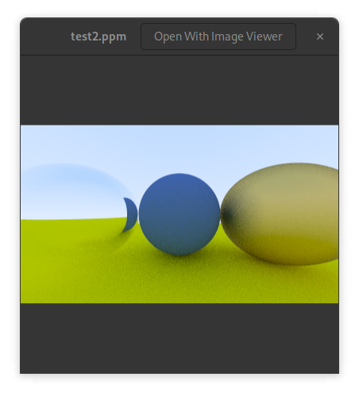
</div>

## hollow glass sphere
This is a sphere of some thickness with another sphere of air inside it.  
We will create two spheres, one for the glass and one for the air bubble:

```c
	t_sphere s3 = sphere(point3(-1.0, 0.0, -1.0), 0.5, (t_material*)&dielectric_material_left);
	t_sphere s4 = sphere(point3(1.0, 0.0, -1.0), 0.4, (t_material*)&dielectric_material_bubble);
```
The result is a hollow glass sphere.

<div style="text-align: center;">
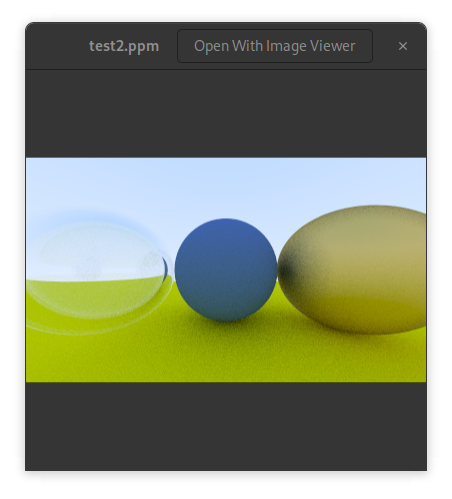
</div>


## Christophe Schlick Approximation
This is because real glass has reflectivity that varies with angle but I did not see any difference so far in the picture being generated. It is probably included for completeness or my world has not enough details right now.

## Positionable Camera
### field of view fov
It is typically expressed as an angle (in degrees or radians) and determines how wide or narrow the view captured by the camera is. A larger FOV allows the camera to capture a wider area of the scene, making objects appear smaller and further apart.  In the book we will use vertical field of view by convension since the horizontal fov will be determined by the aspect ratio of the image.
Now I can express the viewport in function of the vertical field of view and the focal_length.
```c
double theta = degrees_to_radians(c.vfov);
double h = tan(theta/2);
double viewport_height = 2 * h * focal_length;
double viewport_width = viewport_height * ((double)c.image_width/c.image_height);
```

Testing now with 2 touching spheres, using a 90° field of view:

<div style="text-align: center;">
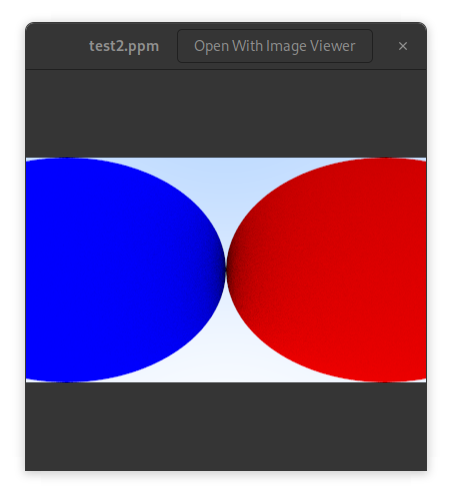
</div>

## Positionable Camera
We can rotate the camera around its normal axis. We need a way to specify the up. and the look from and look at. 
The tutorial uses the common convention of naming this the “view up” (vup) vector.
We will make the viewport height dependent from the vertical field of view and the aspect ratio. 
```c
cam.vfov = 90;
cam.lookfrom = point3(-2,2,1);   // Point camera is looking from
cam.lookat   = point3(0,0,-1);  // Point camera is looking at
cam.vup      = vec3(0,1,0);     // Camera-relative "up" direction

double theta = degrees_to_radians(cam.vfov);
double h = tan(theta/2);
double viewport_height = 2 * h * focal_length;
double viewport_width = viewport_height * ((double)cam.image_width/cam.image_height);
...
```

With a fof of 90 and of 20:

<div style="text-align: center;">
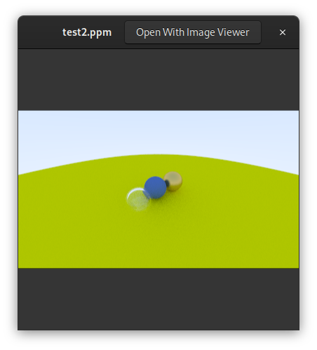
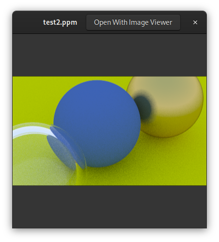
</div>

## Defocus Blur
Also known as depth of field, this is the effect of having objects at different distances from the camera appear out of focus. 

We call the distance between the camera center and the plane where everything is in perfect focus the focus distance. Be aware that the focus distance is not usually the same as the focal length — the focal length is the distance between the camera center and the image plane.

The viewport lies on the focus plane, centered on the camera view direction vector.

Without defocus blur, all scene rays originate from the camera center (or lookfrom). In order to accomplish defocus blur, we construct a disk centered at the camera center.

Since we'll be choosing random points from the defocus disk, we'll need a function to do that: random_in_unit_disk(). This function works using the same kind of method we use in random_in_unit_sphere(), just for two dimensions.

Now the viewport is dependent of the focus distance.
```c
// double focal_length = length(vec3substr(c.lookfrom, c.lookat));

double theta = degrees_to_radians(c.vfov);
double h = tan(theta/2);
double viewport_height = 2 * h * c.focus_dist;
..
```

We get the following result (one glass sphere with an air bubble inside, a matter and one metal sphere):
<div style="text-align: center;">

</div>

## The end of the first book.
The book ends with a new main to create the final image used for the cover. lets do that!

The first pass with the background and the three big spheres. My c code will look like this:
```c
t_lambertian ground;
lambertian_init(&ground, color(0.5, 0.5, 0.5));
t_sphere s1 = sphere(point3(0.0, -1000, 0), 1000.0, (t_material*)&ground);

t_dielectric material1;
dielectric_init(&material1, 1.50);

t_lambertian material2;
lambertian_init(&material2, color(0.4, 0.2, 0.1));

t_metal material3;
metal_init(&material3, color(0.7, 0.6, 0.5), 0.0);

t_sphere s2 = sphere(point3(0, 1, 0), 1.0, (t_material*)&material1);
t_sphere s3 = sphere(point3(-4, 1, 0), 1.0, (t_material*)&material2);
t_sphere s4 = sphere(point3(4, 1, 0), 1.0, (t_material*)&material3);

t_hittable *list[4];

list[0] = (t_hittable*)(&s1);
list[1] = (t_hittable*)(&s2);
list[2] = (t_hittable*)(&s3);
list[3] = (t_hittable*)(&s4);

const t_hittablelist world = hittablelist(list, 4);

// init camera
t_camera c = camera();

// render
render(c, world);
```
And the result is:
<div style="text-align: center;">
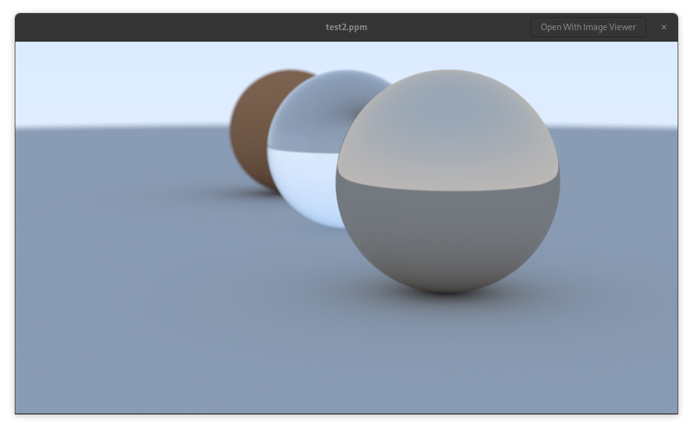
</div>

For the smaller spheres the book uses a for loop. Until now I used the stack exclusively, but creating a sphere in the loop will make me lose the pointer to the struct. I end up with a segmentation fault, my pointers are dangling! The solution is use malloc and I tried this:
```c
 	for (int a = 0; a < 22; a++) 
	{
        for (int b = 0; b < 22; b++) 
		{
            double choose_mat = random_d();
            t_point3 center = point3((double)a + 0.9 * random_d(), 0.2, (double)b + 0.9*random_d());
            if (length(vec3substr(center, point3(4, 0.2, 0))) > 0.9) 
			{
                if (choose_mat < 0.8) 
				{
                    // diffuse
					t_lambertian *sphere_material = malloc(sizeof(t_lambertian));
                    t_color *albedo = malloc(sizeof(t_color)); 
					*albedo = vec3cross(color_random(), color_random());
                    lambertian_init(sphere_material, *albedo);
					t_sphere *s = malloc(sizeof(t_sphere)); 
					*s = sphere(point3(center.x, center.y, center.z), 0.2, (t_material*)sphere_material);
					list[i] = (t_hittable*)(s);
                } 
				else if (choose_mat < 0.95) {
	                //     // metal
			        t_color *albedo = malloc(sizeof(t_color)); 
					*albedo = color_random_min_max(0.5,1);
                	double fuzz = random_double(0, 0.5);
					t_metal *sphere_material = malloc(sizeof(t_metal));
					metal_init(sphere_material, *albedo, fuzz);
					t_sphere *s = malloc(sizeof(t_sphere));
					*s = sphere(point3(center.x, center.y, center.z), 0.2, (t_material*)sphere_material);
					list[i] = (t_hittable*)(s);
                } 
				else 
				{
                	     // glass
					t_dielectric *sphere_material = malloc(sizeof(t_dielectric));
					dielectric_init(sphere_material, 1.5);
					t_sphere *s = malloc(sizeof(t_sphere));
					*s = sphere(point3(center.x, center.y, center.z), 0.2, (t_material*)sphere_material);
					list[i] = (t_hittable*)(s);
				}
            }
			else
				list[i] = NULL;
			i++;
        }
    }
```

This is working. However, I cannot free a material if I dont know if it has albedo or not. I ussed a trick to get polimorphism in C and now there is no way I get to know what struct I had originally unless I introduce a new property in my material class. And this just to free the memory?
There is aLso another problem. The memory allocation makes my program suuuper slow. It hurts.
I will revert to use the stack for spheres and materials. It is a waste of space but it is fine for this implementation:

```c
	t_lambertian sphere_materials_lambertian[22*22 + 4];
	t_metal sphere_materials_metal[22*22 + 4];
	t_dielectric sphere_materials_dielectric[22*22 + 4];
	t_sphere spheres[22 * 22 + 4];

	...
	// in the loop
	if (choose_mat < 0.8) 
	{
		// diffuse
		t_color albedo = vec3cross(color_random(), color_random());
		lambertian_init(&sphere_materials_lambertian[i], albedo);
		spheres[i] = sphere(center, 0.2, (t_material*)&sphere_materials_lambertian[i]);
		list[i] = (t_hittable*)&spheres[i];
	} 
	else if (choose_mat < 0.95) 
	{
		// metal
		t_color albedo = color_random_min_max(0.5,1);
		double fuzz = random_double(0, 0.5);
		metal_init(&sphere_materials_metal[i], albedo, fuzz);
		spheres[i] = sphere(center, 0.2, (t_material*)&sphere_materials_metal[i]);
		list[i] = (t_hittable*)&spheres[i];
	} 
	else 
	{
		// glass
		dielectric_init(&sphere_materials_dielectric[i], 1.5);
		spheres[i] = sphere(point3(center, 0.2, (t_material*)&sphere_materials_dielectric[i]);
		list[i] = (t_hittable*)&spheres[i];
	}
```

It is incredibly faster now, I can literally see the image being generated. With the malloc version I had to wait for minutes. Lesson learned!

This is the last image at full resolution.

<div style="text-align: center;">
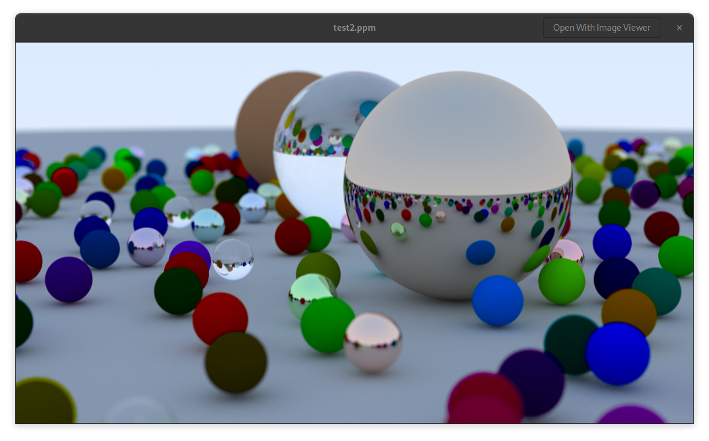
</div>


## links
- [Raytracing in one weekend](https://raytracing.github.io/books/RayTracingInOneWeekend.html)  
- [Raytracing the next week](https://raytracing.github.io/books/RayTracingTheNextWeek.html)  
- [Raytracing the rest of your life](https://raytracing.github.io/books/RayTracingTheRestOfYourLife.html)  
- stb_image.h, a header-only image library available on GitHub at https://github.com/nothings/stb.
- [https://gabrielgambetta.com/computer-graphics-from-scratch/](https://gabrielgambetta.com/computer-graphics-from-scratch/)  
- A raytracer on the back of a business card. [https://fabiensanglard.net/rayTracing_back_of_business_card/](https://fabiensanglard.net/rayTracing_back_of_business_card/)

## Here are a few really good resources by [Fabien Sanglard](https://fabiensanglard.net/about/index.html):

- scratchapixel.com : Great raytracer lessons written by professionals that have worked on Toy Story, Avatar, Lord of the Rings, Harry Potter, Pirates of the Caribbean and many other movies.  
- An Introduction to Ray Tracing : An old book but a Classic.  
- Physically Based Rendering : Heavy on maths but really good and well explained.  

